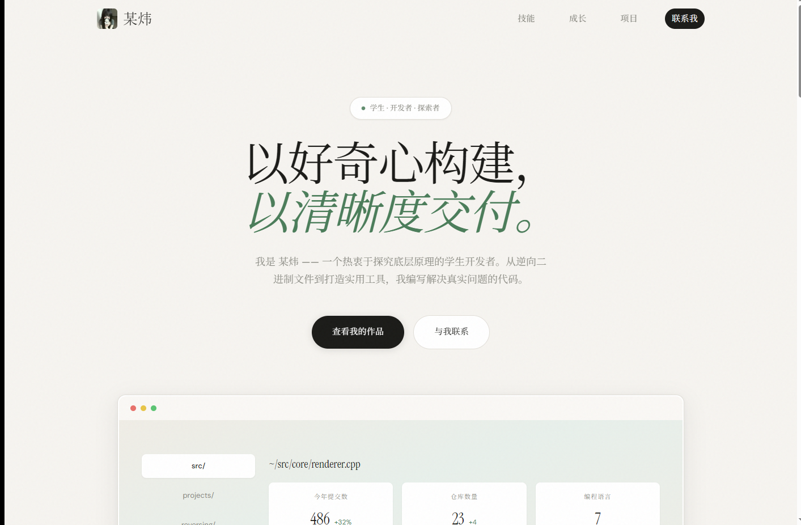

# 某炜 — 个人网站

> 以好奇心构建，以清晰度交付。



## 简介

一个简洁的个人开发者网站，用 Vibe Coding 风格构建。展示技能、成长轨迹和项目作品。

## 技术栈

- 纯 HTML + CSS + JavaScript（无框架依赖）
- CSS Grid / Flexbox 响应式布局
- CSS 动画（导航栏下划线、滚动渐入、弹窗缩放）
- Google Fonts（DM Sans + Noto Serif SC）

## 特性

- 固定导航栏，滚动时显示分隔线
- Hero 区背景图 + 渐变遮罩柔化边缘
- 技能卡片悬停动效
- 时间轴展示成长轨迹
- 项目卡片链接到 GitHub 仓库
- 赞助弹窗（点击弹出二维码）
- 移动端响应式适配

## 预览

直接打开 `index.html` 即可预览。

## 本地运行

```bash
git clone https://github.com/Mou-1205/Mou-Two.git
cd Mou-Two
# 用任意浏览器打开 index.html
start index.html
```

## License

MIT
